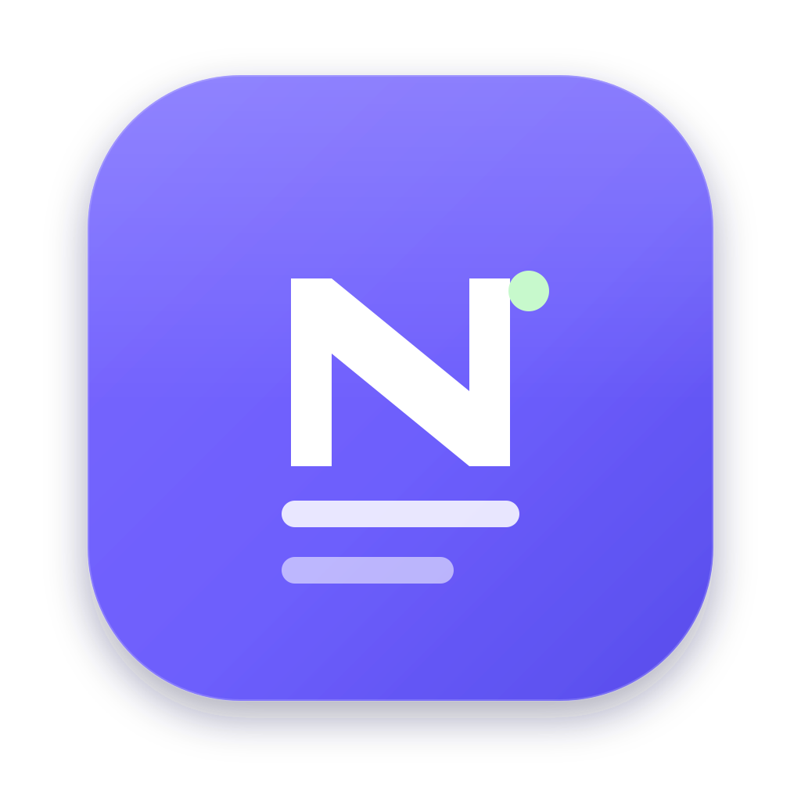

# NoteX

A modern, sleek markdown note-taking desktop app — built with **Tauri 2**, **React**, **TypeScript**, and **CodeMirror 6**.



## Features

**Writing & Markdown**
- **Live markdown editing** — CodeMirror with syntax highlighting, rendered side-by-side. Toggle Editor / Split / Preview.
- **Rich rendering** — GFM, **callouts** (`> [!note]`, `> [!warning]`, …), **KaTeX math** (`$E=mc^2$`), footnotes, tables, and **click-to-toggle checkboxes**. Code is syntax-highlighted.
- **`[[Wiki-links]]` + backlinks** — link notes with `[[` autocomplete; see what links here in the info panel.
- **Info panel** — word count, reading time, dates, an **outline** (table of contents), and **backlinks**.

**Organize**
- **Nested & inline tags** — type `#work/ios` anywhere; the sidebar shows a collapsible **tag tree**. `#` autocompletes.
- **Folders** (color-coded), **pin** & **favorite**, and **sort** by edited / created / title.
- **Full-text search** + a **Ctrl + K command palette** to jump anywhere or run actions.
- **Trash** — deletes are soft; restore anytime or empty the trash.

**Security 🔒**
- **Vault encryption** — encrypt everything at rest with **AES-256-GCM** (key from your passphrase via PBKDF2, held only in memory). Unlock screen on launch.
- **Per-note lock** — lock individual notes; they stay encrypted and hidden until unlocked.
- **Windows Hello** — unlock with fingerprint / face / PIN (DPAPI-protected key).
- **Auto-lock** — clear the key from memory after idle.

**Local-first** — everything stays on your machine. No account, no cloud, no telemetry. Import / export `.md` files.

## Keyboard shortcuts

| Shortcut | Action |
| --- | --- |
| `Ctrl + K` | Command palette / search |
| `Ctrl + N` | New note |
| `Ctrl + \` | Toggle sidebar |
| `Ctrl + Shift + D` | Cycle theme (light / dark / system) |

## Development

Prerequisites: **Node.js**, **Rust** (stable), and the MSVC C++ build tools (already present via Visual Studio).

```bash
npm install

# Run in the browser (fast preview, notes saved to localStorage)
npm run dev

# Run the real desktop app (hot-reload)
npm run app

# Build a distributable installer + .exe
npm run app:build
```

The built installer lands in `src-tauri/target/release/bundle/`.

## Where are my notes?

`%APPDATA%\com.silverslipper.notex\store\data.json`

Everything lives in that single JSON file — easy to back up or sync yourself.

## Tech

- **Tauri 2** — native window, tiny binary, Rust backend
- **React 18 + Zustand** — UI and state
- **CodeMirror 6** — the editor, with a custom variable-driven theme
- **marked + DOMPurify + highlight.js** — safe markdown rendering with code highlighting
- **lucide-react** — icons
